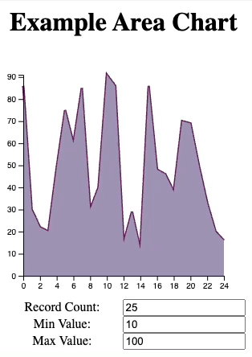

# D3 in React

## Exercise 1

You are going to create this area chart.



The src folder already contains some files to get you started quickly.
The `Demo` component contains the h1, the AreaChart and the form.
The `AreaChart` component is responsible for rendering the area and axes.

### Approach

1. Try to render as much as possible with React
2. For the parts that D3 should render (eg. axes) you need an _empty_ `<g>`.
3. D3 takes over:

   ```ts
   const myRef = useRef<SVGGElement>(null);
   useEffect(() => {
     myRef && select(myRef).call(...);
   }, [...]);

   <g ref={myRef} />
   ```

### Requirements

- The chart data is of type `number[]`.
- The dimensions are 300 x 300px.
- The fill color is #9d92b2 and the line color is #6c1d5f with a stroke thickness of 3px.
- The x-axis domain is [0, maxValue]
- The y-axis domain is [0, data.length-1].
- For every visual element, decide carefully whether React or D3 is responsible for rendering.
- Every 2000ms the data updates to a new data set with random values as configured using the 3 form fields (`import { interval } from 'd3-timer'`).
- The transition from old to new area takes 1000ms. The easiest a CSS transform. For more control interpolate between the old and the new array.

## Exercise 2

Extract code from `AreaChart` into a new file `chartHelpers.ts`.

## Exercise 3

Create a `ScatterPlot` component that reuses as many of the chart helpers.

### Requirements

- The chart data is of type `[number,number][]` and every data point maps onto [X,Y].
- The dimensions are 300 x 300px.
- The data points are rendered as steelblue circles with opacity 0.5 and radius 4px.
- Same data generation and transitions as with the area chart.
